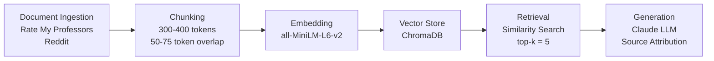

# Project 1 Planning: The Unofficial Guide

> Write this document before you write any pipeline code.
> Your spec and architecture diagram are what you'll use to direct AI tools (Claude, Copilot, etc.) to generate your implementation — the more specific they are, the more useful the generated code will be.
> Update the Retrieval Approach and Chunking Strategy sections if you change your approach during implementation.
> Update this file before starting any stretch features.

---

## Domain

**Domain:** Student reviews and experiences with Hunter College Computer Science professors.

This knowledge is difficult to find because student feedback is scattered across platforms like Rate My Professors and Reddit, is highly opinion-based and unstructured, and often buried in comment threads that are hard to search. This system organizes that scattered feedback into a searchable format so students can quickly find information about a specific professor's teaching style, exam difficulty, grading practices, workload, and whether other students recommend them — all in one place.

**Questions this system will answer:**
1. Is Tong Yi a good professor for intro CS at Hunter?
2. How hard are Saad Mneimneh's exams and does he curve?
3. What's the workload like for Tiziana Ligorio's classes?
4. Does Subash Shankar post lecture notes online?
5. Should I take Eric Schweitzer for CSCI 49390?
6. Which Hunter CS professor is easiest for discrete math?
7. How do students typically prepare for Mneimneh's exams?
8. Is Ligorio's class more project-based or exam-based?
9. What do students say about Tong Yi's grading?
10. Who is the most recommended CS professor at Hunter for data structures?

---

## Documents

<!-- List your specific sources: URLs, subreddit names, forum threads, or file descriptions.
     Aim for at least 10 sources that together cover different subtopics or perspectives within your domain. -->

| # | Source | Description | URL or location |
|---|--------|-------------|-----------------|
| 1 | Tong Yi — Rate My Professors | 123 student ratings (2.2/5); covers teaching effectiveness, exam difficulty, grading, overall recommendation. 54% of ratings are 1-star "Awful." | https://www.ratemyprofessors.com/professor/2634841 |
| 2 | Tong Yi — Reddit r/HunterCollege | Thread asking students about their CS experience with Tong Yi. Contains direct student accounts of teaching style, difficulty, and whether to take her. | https://www.reddit.com/r/HunterCollege/comments/v6kzhw/for_those_who_have_tong_yi_for_cs_how_bad_is_she/ |
| 3 | Eric Schweitzer — Rate My Professors | Student ratings page for Schweitzer; covers course difficulty, grading, and teaching style across multiple CS courses. | https://www.ratemyprofessors.com/professor/257192 |
| 4 | Eric Schweitzer — Reddit r/HunterCollege | Thread specifically about CSCI 49390 with Schweitzer. Students discuss course content, what to expect, and workload. | https://www.reddit.com/r/HunterCollege/comments/1l7feml/csci_49390_with_eric_schweitzer/ |
| 5 | Subash Shankar — Rate My Professors | 82 ratings (2.7/5, 4.2/5 difficulty, 28% would take again). Reviews confirm he does not post notes to Brightspace and provides no practice exams. | https://www.ratemyprofessors.com/professor/257190 |
| 6 | Subash Shankar — Reddit r/HunterCollege | Thread about CSCI 260 with Shankar. Students share experiences on note-taking expectations, exam preparation, and workload. | https://www.reddit.com/r/HunterCollege/comments/1rz0e2c/csci260_w_shankur/ |
| 7 | Tiziana Ligorio — Rate My Professors | 118 ratings (3.1/5, 3.4/5 difficulty); sharply polarized — 40 students rated her Awesome and 41 rated her Awful. Covers teaching style and grading. | https://www.ratemyprofessors.com/professor/815879 |
| 8 | Tiziana Ligorio — Reddit r/HunterCollege | Open discussion thread asking for opinions on Ligorio. Students debate her teaching approach, whether to take her, and course experience. | https://www.reddit.com/r/HunterCollege/comments/scpbo2/opinions_on_prof_tiziana_ligorio/ |
| 9 | Saad Mneimneh — Rate My Professors | 128 ratings (3.4/5, 4.4/5 difficulty, 58% would take again). Reviews confirm he curves exams, grading is test-heavy, and exams require 1–2 weeks of intensive prep. | https://www.ratemyprofessors.com/professor/926045 |
| 10 | Saad Mneimneh — Reddit r/HunterCollege | Thread on how students passed CSCI 150 (Discrete Math). Students share study strategies, how they prepared, and general survival advice for his course. | https://www.reddit.com/r/HunterCollege/comments/b2pg0t/how_did_you_pass_csci_150_discrete_math/ |

---

## Chunking Strategy

<!-- How will you split documents into chunks?
     State your chunk size (in tokens or characters), overlap size, and explain why those
     numbers fit the structure of your documents.
     A review-heavy corpus warrants different chunking than a long FAQ. -->

**Chunk size:** 300–400 tokens

**Overlap:** 50–75 tokens

**Reasoning:** My documents are a mix of Rate My Professors reviews and Reddit discussions. Most are fairly short, just a few sentences or a paragraph. Rate My Professors has many reviews per professor, which helps give a fuller picture. Reddit posts tend to be more detailed and conversational.

I chose a chunk size of 300 to 400 tokens so each chunk holds one complete review without mixing in unrelated opinions. The overlap of 50 to 75 tokens acts as a buffer. It repeats a few sentences between chunks so no chunk loses the context it needs to make sense on its own.

If chunks are too small, a review gets cut off and loses its meaning. If chunks are too large, multiple unrelated reviews get grouped together, making it harder to find the right one.

---

## Retrieval Approach

<!-- Which embedding model are you using (e.g., all-MiniLM-L6-v2 via sentence-transformers)?
     How many chunks will you retrieve per query (top-k)?
     If you were deploying this for real users and cost wasn't a constraint, what tradeoffs
     would you weigh in choosing a different embedding model — context length, multilingual
     support, accuracy on domain-specific text, latency? -->

**Embedding model:** all-MiniLM-L6-v2 via sentence-transformers

**Top-k:** 5

**Reasoning:** This model searches by meaning, not just matching exact words. So if a student asks "is this professor a hard grader?" it can still find a review that says "she grades very strictly" even though the words are different.

I set top-k to 5, meaning the system pulls the 5 most relevant chunks for each question. This gives enough variety to show different student opinions without flooding the response with too much unrelated content.

**Production tradeoff reflection:** For a real deployment, I would look into larger models with better accuracy, but this model is a solid and practical choice for this project.

---

## Evaluation Plan

<!-- List your 5 test questions with their expected correct answers.
     Questions should be specific enough that you can judge whether the system's response
     is right or wrong. "What are good dining halls?" is too vague.
     "What do students say about wait times at [dining hall name] during lunch?" is testable. -->

| # | Question | Expected answer |
|---|----------|-----------------|
| 1 | What do students say about Tong Yi's workload or homework difficulty? | Students describe Tong Yi's classes as challenging, with difficult assignments and a heavy workload. |
| 2 | How do students describe Eric Schweitzer's teaching style or clarity? | Students say Eric Schweitzer gives difficult pop quizzes and expects students to stay on top of the material, but the course is manageable with consistent studying. |
| 3 | What do students say about Subash Shankar's grading style or fairness? | Students generally describe Subash Shankar as a tough grader with difficult exams and assignments, but note that students who put in the effort can succeed. |
| 4 | How do students rate Tiziana Ligorio's approachability or office hours? | Students describe Tiziana Ligorio as helpful and approachable, and willing to assist students who seek extra help. |
| 5 | What is the overall sentiment students express about Saad Mneimneh's courses? | Students generally view Saad Mneimneh's courses as challenging but rewarding, and helpful for developing strong problem-solving skills. |

---

## Anticipated Challenges

<!-- What could go wrong? Name at least two specific risks with reasoning.
     Consider: noisy or inconsistent documents, missing source attribution, off-topic
     retrieval, chunks that split key information across boundaries. -->

1. **Outdated or biased reviews:** Professors may change their teaching style, grading policies, or course structure over time, which could make older reviews inaccurate or misleading for current students. Additionally, since reviews reflect personal experiences, opinions can vary significantly depending on how much effort a student put into the course — making it difficult to identify patterns that apply broadly.

2. **Irrelevant or incomplete retrieval:** The retrieval system may return chunks that are not fully relevant to the user's question. This could happen if reviews share similar keywords but discuss different topics, causing the system to surface loosely related content. There is also a risk that important context gets split across chunk boundaries, so the system retrieves only part of an opinion without the full picture.

---

## Architecture

---

## AI Tool Plan

<!-- For each part of the pipeline below, describe:
     - Which AI tool you plan to use (Claude, Copilot, ChatGPT, etc.)
     - What you'll give it as input (which sections of this planning.md, which requirements)
     - What you expect it to produce
     - How you'll verify the output matches your spec

     "I'll use AI to help me code" is not a plan.
     "I'll give Claude my Chunking Strategy section and ask it to implement chunk_text()
     with my specified chunk size and overlap" is a plan. -->

**Milestone 3 — Ingestion and chunking:** I will give Claude my Chunking Strategy section and ask it to write a `chunk_text()` function that splits documents into 300 to 400 token chunks with 50 to 75 token overlap. I will check that reviews are not being cut off mid-sentence or merged with unrelated ones.

**Milestone 4 — Embedding and retrieval:** I will give Claude my Retrieval Approach section and ask it to write code that stores embeddings in ChromaDB and retrieves the top 5 most relevant chunks for a user's question. I will test it by asking questions and checking that the returned chunks actually relate to what was asked.

**Milestone 5 — Generation and interface:** I will use Claude to help write prompts that tell the LLM how to summarize reviews and highlight key themes, while only using information from the retrieved chunks. I will check the output by running my 5 evaluation questions and comparing the answers to what I expected.
